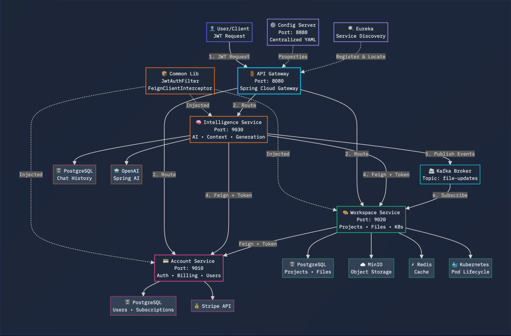
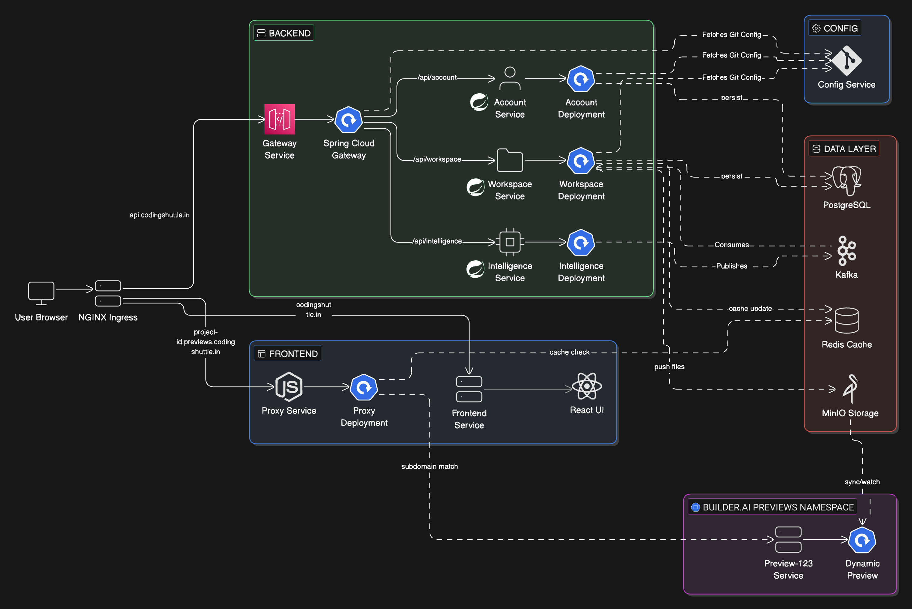

# Builder.ai — Distributed Lovable style AI App Builder

Builder.ai is a distributed, microservices-based platform that lets users describe an
application in natural language and have an LLM generate, edit, and live-preview a full
working codebase — similar to "Lovable". The backend is a Spring Cloud microservices
system running on Google Kubernetes Engine (GKE); the frontend is a Vite + React + Tailwind
+ shadcn/ui single-page app with a chat driven code editor and live preview.

---

## Architecture

### Logical / Microservices View

Each Spring Boot service authenticates requests locally via a shared `JwtAuthFilter`
(no dependency on the gateway for auth), and services talk to one another through
**Feign** clients that automatically forward the caller's JWT.



### Kubernetes Deployment Topology

Traffic enters through an **NGINX Ingress**. `/api` traffic is routed to the Spring Cloud
Gateway; everything else goes to a Node.js proxy that serves the frontend and proxies live
project previews. User previews run in an isolated `builderai-previews` namespace, separate
from the core application namespace `builderai-core`.



---

## Services

| Service | Port | Primary Responsibility | Storage | Key Integrations | Cross-Service Calls (Feign) |
|---|---|---|---|---|---|
| **Account Service** | 9010 | User identity, authentication, and Stripe billing | PostgreSQL (Users, Plans, Subscriptions) | Stripe API | None |
| **Workspace Service** | 9020 | Project management, file tree, Kubernetes deployments | PostgreSQL (Projects, Members), MinIO (Files) | Kubernetes API, Redis | AccountService (check limits, users) |
| **Intelligence Service** | 9030 | AI chat, context gathering, code generation | PostgreSQL (Chat Sessions, Messages, Events) | OpenAI (Spring AI) | WorkspaceService (read files), AccountService (check AI limits) |
| **API Gateway** | 8080 | Spring Cloud Gateway — single entrypoint, JWT validation, routing | — | — | All downstream services |
| **Discovery Service** | 8761 | Netflix Eureka service registry & discovery | — | — | — |
| **Config Service** | 8888 | Centralized configuration (Spring Cloud Config, Git-backed) | Git repo | — | — |
| **Common Lib** | — | Shared security filter, Feign interceptor, and DTOs | — | — | — |

### Account Service
- **Dependencies:** `spring-boot-starter-web`, `spring-data-jpa`, `postgresql`, `stripe-java`, `mapstruct`, `spring-cloud-starter-netflix-eureka-client`
- **Key entities:** `User`, `Plan` (Free, Pro), `Subscription`
- **Security:** `AccountSecurityConfig` exposes `/auth/**` and `/webhooks/stripe` publicly; secures everything else.
- **Internal API:** `InternalAccountController` exposes `/internal/v1/...` for other microservices to fetch user DTOs and verify billing plans.

### Workspace Service
- **Dependencies:** `spring-boot-starter-web`, `spring-data-jpa`, `minio`, `kubernetes-client` (Fabric8), `spring-data-redis`, `spring-cloud-starter-openfeign`
- **Key entities:** `Project`, `ProjectMember`, `ProjectFile`, `Preview` (K8s pod mapping)
- **Cloud config:** `StorageConfig` (MinIO), `KubernetesConfig`, `RedisConfig`
- **Security logic:** `SecurityExpressions` — custom `@PreAuthorize("@security.canEditProject(#id)")` ownership checks via `ProjectMemberRepository`.
- **Feign clients:** `AccountClient` — verifies the user's `maxProjects` limit during project creation.

### Intelligence Service
- **Dependencies:** `spring-ai-starter-model-openai`, `spring-data-jpa`, `spring-cloud-starter-openfeign`
- **Key entities:** `ChatSession`, `ChatMessage`, `ChatEvent`, `UsageLog` (tracks LLM thoughts, file edits, tool uses)
- **AI components:** `AiGenerationServiceImpl` (prompt execution), `LlmResponseParser` (regex to extract `<file>` and `<tool>` tags)
- **Advisors & tools:** `FileTreeContextAdvisor` (injects the current file tree into the prompt), `CodeGenerationTools` (lets the LLM read specific files)
- **Feign clients:** `WorkspaceClient` (fetch file trees & content for context), `AccountClient` (verify AI daily token limits)

### Common Lib
| Component | What it does | Why it's needed |
|---|---|---|
| `JwtAuthFilter` | Extracts the Bearer token and populates the `SecurityContext`. | Every service authenticates requests locally, independent of the Gateway. |
| `FeignClientInterceptor` | Grabs the user's JWT from context and attaches it to outbound Feign requests. | Lets the Intelligence service call the Workspace service seamlessly as the logged-in user. |
| Shared DTOs | `UserDto`, `PlanDto`, `FileTreeDto`, etc. | Prevents JPA `@Entity` classes from leaking across microservice boundaries. |

---

## Tech Stack

**Backend**
- Java + Spring Boot, Spring Cloud (Gateway, Config, Netflix Eureka, OpenFeign)
- Spring AI (OpenAI models) for code generation
- PostgreSQL (with pgvector) · Redis · Kafka · MinIO (object storage)
- Fabric8 Kubernetes client for dynamic preview deployments
- Stripe for billing
- Maven (with Jib for container image builds)

**Frontend** (`frontend/`)
- Vite + React + TypeScript
- Tailwind CSS + shadcn/ui
- Chat-driven UI with streaming responses, file tree, Monaco-style code editor, and live preview panel
- Vitest for testing

**Infrastructure**
- Google Kubernetes Engine (GKE)
- NGINX Ingress Controller
- Node.js proxy for frontend serving and preview routing

---

## Repository Layout

```
.
├── Architecture.pdf                # Source architecture document
├── docs/images/                    # Architecture diagrams used in this README
├── backend/
│   ├── api-gateway/                # Spring Cloud Gateway (entrypoint, JWT, routing)
│   ├── config-service/             # Spring Cloud Config (Git-backed)
│   ├── discovery-service/          # Netflix Eureka registry
│   ├── account-service/            # Auth, users, Stripe billing
│   ├── workspace-service/          # Projects, files, K8s deployments
│   ├── intelligence-service/       # AI chat & code generation
│   ├── common-lib/                 # Shared security, Feign interceptor, DTOs
│   └── k8s/                        # Kubernetes manifests
│       ├── infra/                  # Namespaces, ingress, network policies, runner pool
│       ├── stateful/               # PostgreSQL/pgvector, Kafka, Redis, MinIO
│       ├── services/               # Service Deployments & Services
│       └── proxy/                  # Node.js frontend/preview proxy
└── frontend/                       # Vite + React + Tailwind + shadcn/ui SPA
```

---

## Getting Started

### Prerequisites
- JDK 17+ and Maven
- Node.js 18+ and npm
- Docker
- A running PostgreSQL, Redis, Kafka, and MinIO (or use the manifests in `backend/k8s/stateful/`)
- `gcloud` and `kubectl` (for cluster deployment)

### Run the Frontend
```bash
cd frontend
npm install
npm run dev
```

### Run a Backend Service
Each service is a standalone Spring Boot app. Start them in dependency order —
**Config Service → Discovery Service → API Gateway → domain services**:
```bash
cd backend/config-service && ./mvnw spring-boot:run
# then, in separate terminals:
cd backend/discovery-service && ./mvnw spring-boot:run
cd backend/api-gateway && ./mvnw spring-boot:run
cd backend/account-service && ./mvnw spring-boot:run
cd backend/workspace-service && ./mvnw spring-boot:run
cd backend/intelligence-service && ./mvnw spring-boot:run
```
Services read their configuration from the Config Service (`CONFIG_SERVER_URL`,
default `http://localhost:8888`) and register with Eureka (`http://localhost:8761`).

---

## Deploying to Kubernetes (GKE)

The steps below mirror the deployment runbook in `Architecture.pdf`.

**1. Connect to the GKE cluster** — bridges your local `kubectl` to the cloud cluster:
```bash
gcloud container clusters get-credentials builderai-me-cluster \
  --region asia-south1 --project <your-project-id>
```

**2. Create the namespaces** — `builderai-core` for the app, `builderai-previews` to isolate dynamic user previews:
```bash
kubectl create namespace builderai-core
kubectl create namespace builderai-previews
```

**3. Apply base configuration (secrets & config maps)** — load env vars and credentials:
```bash
kubectl create secret generic app-secrets --from-env-file=.env -n builderai-core
kubectl apply -f backend/k8s/configmaps/ -n builderai-core
```

**4. Deploy stateful infrastructure first** — PostgreSQL, Redis, Kafka, MinIO must be up before the apps:
```bash
kubectl apply -f backend/k8s/stateful/ -n builderai-core
```

**5. Deploy the microservices** — Deployments (Jib-built images) and Services (internal DNS):
```bash
kubectl apply -f backend/k8s/services/ -n builderai-core
```

**6. Install the NGINX Ingress Controller** — provisions a Google Cloud load balancer:
```bash
kubectl apply -f https://raw.githubusercontent.com/kubernetes/ingress-nginx/controller-v1.8.2/deploy/static/provider/cloud/deploy.yaml
```
Wait for Google to assign a public IP (note the `EXTERNAL-IP` for DNS):
```bash
kubectl get svc ingress-nginx-controller -n ingress-nginx -w
```

**7. Apply the ingress routing rules** — routes `/api` to the Spring Cloud Gateway and everything else to the Node.js proxy:
```bash
kubectl apply -f backend/k8s/infra/ingress.yaml -n builderai-core
```

---

## How It Works (Request Flow)

1. The user logs in via **Account Service** (`/auth/**`) and receives a JWT.
2. The browser hits the **NGINX Ingress** → `/api` is routed to the **API Gateway**.
3. The Gateway validates the JWT and forwards the request to the target service.
4. To build an app, the user chats via the **Intelligence Service**, which:
   - injects the project's current file tree into the prompt (`FileTreeContextAdvisor`),
   - calls **Workspace Service** over Feign to read file content for context,
   - checks AI usage limits with **Account Service**,
   - generates code, parsing `<file>`/`<tool>` tags from the LLM response.
5. **Workspace Service** persists files to **MinIO**, caches state in **Redis**, publishes
   `file-updates` events to **Kafka**, and spins up isolated **preview pods** in the
   `Builder.AI-previews` namespace via the Kubernetes API.
6. The user sees the running app in the **live preview panel**.

---