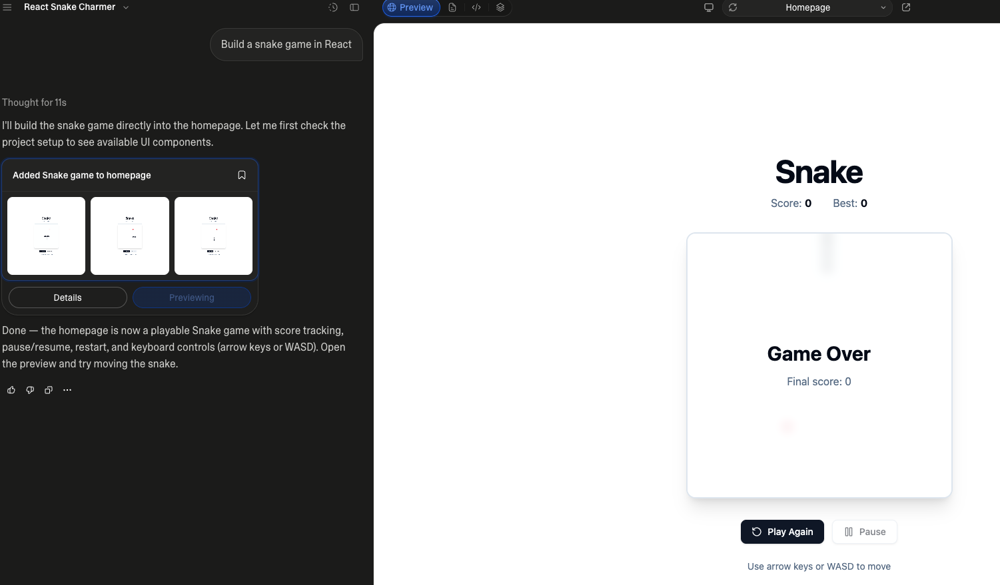

# Builder.ai

Build React apps with natural-language prompts (e.g., ‘Build a snake game in React’). Builder.ai combines streaming AI chat, a browser code editor, and live previews backed by Kubernetes.



**Stack:** React, TypeScript, Tailwind CSS · Java 21, Spring Boot, Spring Cloud, Spring AI · PostgreSQL, Kafka, MinIO, Redis · Kubernetes, Fabric8.

## Architecture

Click an image for the full-size 2× copy, or expand **Zoomed details** for close-ups. The original PNGs are linked beneath each overview.

### 1. Microservices

[](docs/images/architecture-microservices-2x.png?raw=true&v=1)

[Original PNG](docs/images/architecture-microservices.png?raw=true&v=5480ea0) · [2× full-size PNG](docs/images/architecture-microservices-2x.png?raw=true&v=1)

<details>
<summary>Zoomed details</summary>

**Gateway and AI service**

[](docs/images/architecture-microservices-zoom-gateway.png?raw=true&v=1)

**Messaging, workspace and account services**

[](docs/images/architecture-microservices-zoom-services.png?raw=true&v=1)

</details>

The **API Gateway** validates JWTs and routes requests to three domain services:

| Service | Responsibility |
| --- | --- |
| [Account](backend/account-service/) | Authentication, users, subscription plans, and Stripe billing. |
| [Workspace](backend/workspace-service/) | Projects, member permissions, file storage, and preview deployment. |
| [Intelligence](backend/intelligence-service/) | AI generation, file context, chat history, and token usage. |

**Config Service** supplies Git-backed configuration; **Discovery Service** provides Eureka service discovery. Domain services also validate JWTs locally through [common-lib](backend/common-lib/), which shares DTOs, event contracts, and a Feign interceptor that forwards the caller's token. OpenFeign handles synchronous service calls; Kafka carries asynchronous file-storage requests and replies.

### 2. AI generation and storage

[](docs/images/ai_design_architecture-2x.png?raw=true&v=1)

[Original PNG](docs/images/ai_design_architecture.png?raw=true) · [2× full-size PNG](docs/images/ai_design_architecture-2x.png?raw=true&v=1)

<details>
<summary>Zoomed details</summary>

**Frontend, backend and streamed output**

[](docs/images/ai_design_architecture-zoom-streaming.png?raw=true&v=1)

**System prompt, file context and model tools**

[](docs/images/ai_design_architecture-zoom-context.png?raw=true&v=1)

**Response parsing, metadata and file storage**

[](docs/images/ai_design_architecture-zoom-storage.png?raw=true&v=1)

</details>

1. **Gather context:** Intelligence combines the user prompt, system instructions, and the project's file tree. The `read_files` tool retrieves selected file contents through Workspace.
2. **Stream the response:** Spring AI streams model output to the React UI over Server-Sent Events (SSE), while the backend buffers the complete response and records token usage.
3. **Parse and persist:** The parser extracts `<message>`, `<file>`, and `<tool>` blocks into chat events. Kafka sends file edits to Workspace, which writes content to **MinIO** and file metadata to **PostgreSQL**.
4. **Confirm writes:** Storage replies mark file-edit events `CONFIRMED` or `FAILED`. Processed saga IDs let Workspace recognize duplicate requests and avoid repeating successful writes.

### 3. Kubernetes previews

[](docs/images/architecture-kubernetes-2x.png?raw=true&v=1)

[Original PNG](docs/images/architecture-kubernetes.png?raw=true&v=5480ea0) · [2× full-size PNG](docs/images/architecture-kubernetes-2x.png?raw=true&v=1)

<details>
<summary>Zoomed details</summary>

**Deployment requests and preview routing**

[](docs/images/architecture-kubernetes-zoom-routing.png?raw=true&v=1)

**Runner pods, syncers and network isolation**

[](docs/images/architecture-kubernetes-zoom-pods.png?raw=true&v=1)

</details>

- **Execute:** Workspace uses Fabric8 to claim an idle pod from a runner pool. Each pod has a Node.js **runner** and a MinIO **syncer** sharing a workspace volume. The runner installs dependencies and starts Vite on port `5173`.
- **Keep previews live:** The syncer watches project files in MinIO and mirrors changes into the pod; Vite hot module replacement updates the preview.
- **Route and isolate:** Redis maps each project hostname to its pod address. The Node.js reverse proxy forwards HTTP and WebSocket traffic. Preview pods run in `builder-ai-previews`, separate from `builder-ai-core`; network policies restrict incoming traffic and communication between preview pods.

The [Kubernetes manifests](backend/k8s/) include NGINX ingress routes for the frontend, API gateway, and wildcard preview domains.

### 4. Data model

[](docs/images/ER_Diagram-2x.png?raw=true&v=1)

[Original PNG with full schema](docs/images/ER_Diagram.png?raw=true) · [2× full-size PNG](docs/images/ER_Diagram-2x.png?raw=true&v=1)

<details>
<summary>Zoomed details</summary>

**Users, subscriptions, plans and usage**

[](docs/images/ER_Diagram-zoom-billing.png?raw=true&v=1)

**Project ownership and memberships**

[](docs/images/ER_Diagram-zoom-membership.png?raw=true&v=1)

**Projects, files and previews**

[](docs/images/ER_Diagram-zoom-projects.png?raw=true&v=1)

**Chat sessions and messages**

<a href="docs/images/ER_Diagram-zoom-chat.png?raw=true&amp;v=1"></a>

</details>

- **Accounts and billing:** Users subscribe to plans that define project, preview, and AI usage allowances.
- **Projects and collaboration:** Memberships associate users with projects and permissions. File records hold paths and MinIO object keys; the diagram also models project previews.
- **Conversations and usage:** Chat sessions belong to a project/user pair and contain messages. The implementation adds ordered chat events and daily token-usage records.

Each domain service has its own PostgreSQL database; links across services are logical references. The diagram is conceptual: ownership is implemented through `ProjectMember` roles (`OWNER`, `EDITOR`, `VIEWER`), and active previews are tracked through Kubernetes pod labels and Redis routes.

## Development setup

Requires **Java 21**, Node.js/npm, PostgreSQL, Kafka, Redis, and MinIO. Live previews also require Kubernetes and the runner pool.

Backend settings come from a separate configuration repository. Set `SPRING_CLOUD_CONFIG_SERVER_GIT_URI` for Config Service and provide the service settings and credentials for your environment. Clients use `CONFIG_SERVER_URL`, defaulting to `http://localhost:8888`. Project creation requires a `projects` bucket and the starter template under `starter-projects/react-vite-tailwind-daisyui-starter/` in MinIO.

Install the shared backend library first, from the repository root:

```bash
cd backend/common-lib
./mvnw install
```

Run `./mvnw spring-boot:run` in separate terminals from each service directory: **config-service → discovery-service → account-service, workspace-service, intelligence-service → api-gateway**.

Start the frontend from the repository root:

```bash
cd frontend
npm ci
npm run dev
```

The UI runs at `http://localhost:5173`; its API base URL is configured in [frontend/src/lib/api.ts](frontend/src/lib/api.ts) and currently points to `http://localhost:8080`.
